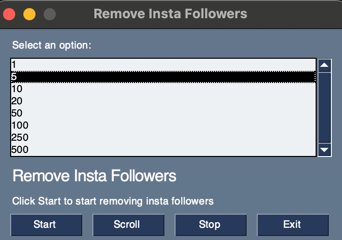
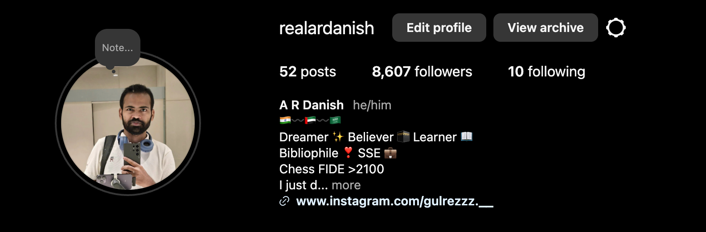
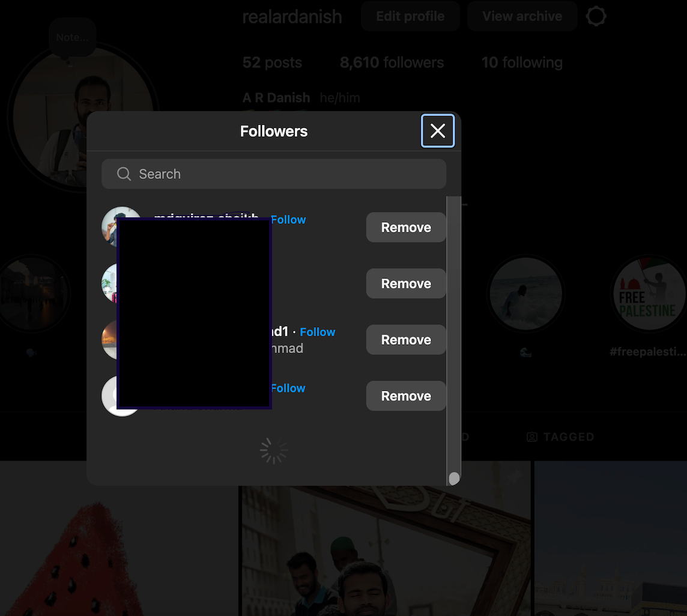
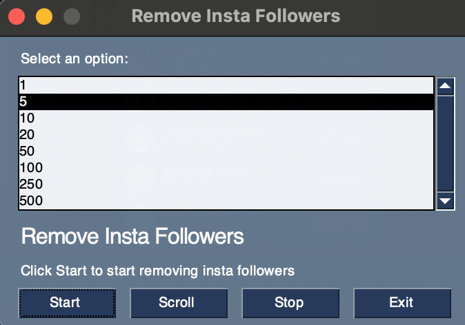

## Run
```commandline
python3 Main.py
```

## Start

#### Choose number of followers to remove and click '**Start**




It'll change the tab and select followers




It'll scroll down for long for the first time as on top I've genuine followers



 It'll start removing


#### Click the start again to remove more


#### Click the exit to close application


### Happy Automating

## A R